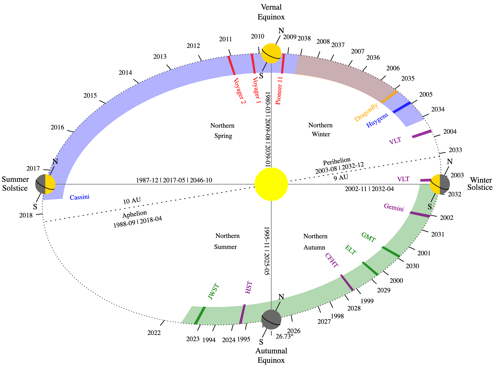

Titan orbit
===========



Infos
-----
```bash
python Titan_orbit.py
>>> Date coverage: 1980-01-02 | 2032-12-31
>>> Orbit       : 10751 days (Earth) = 29 years 5 months 7 days | 674 days (Titan)
>>> Equinox  (V): 1980-02-22 | 2009-07-30
>>> Solstice (S): 1987-11-25 | 2017-05-14
>>> Equinox  (A): 1995-11-07 | 2025-04-24
>>> Solstice (W): 2002-10-23 | 2032-03-26
>>> Obliquity   : 26.73 deg
>>> N Spring    : 2833 days (Earth) | 177 days (Titan) | Ls =   0 | R = 9.44 UA
>>> N Summer    : 2904 days (Earth) | 182 days (Titan) | Ls =  90 | R = 10.03 UA
>>> N Autumn    : 2542 days (Earth) | 159 days (Titan) | Ls = 180 | R = 9.59 UA
>>> N Winter    : 2472 days (Earth) | 155 days (Titan) | Ls = 270 | R = 9.03 UA
>>> Perihelion  : 2003-07-21 | 2032-11-21 | 9.01 UA  | Ls = 280
>>> Aphelion    : 1988-08-31 | 2018-04-07 | 10.07 UA | Ls = 98
>>> 360*(Date - Eq_V)/orbit = Ls + A * sin[2.PI/360 * (Ls - C)] + B
>>> with: A = 6.17 | B = 6.05 | C = 101.04
```

_Note:_ 1 Titan day = 15.945 Earth day

Usage
-----
```bash
python Titan_orbit.py 30
>>> Date: 1982-08-12

python Titan_orbit.py 30+1
>>>Date: 2012-01-18

python Titan_orbit.py 2012-01-18
>>> Ls: 29.99
```


Time vs. Solar Longitude
--------------------------
$$360 \cdot \frac{\text{Date} - \text{Eq}^V}{\text{Orbit}} = L_s + A * \sin\left(2\pi\cdot \frac{L_s - C}{360} \right) + B$$
with: A = 6.17 | B = 6.06 | C = 100.94 (Fit).

We get a transcendental equation which is solved with the Newton method, ie. the series:
$$ L_s^0 = 360 \cdot \frac{\text{Date} - \text{Eq}^V}{\text{Orbit}} - B$$
$$ L_s^{n+1} = L_s^n - \frac{
L_s^n - L_s^0 + A\cdot\sin\left(2\pi\cdot \frac{L_s^n - C}{360} \right)
}{
1 + A\cdot\frac{2\pi}{360}\cos\left(2\pi\cdot \frac{L_s^n - C}{360} \right)
}$$
converge to the value of $L_s$.

Solar longitude on an ellipse
-------------------------------
Ellipse canonical cartesian equation:
$$ \left( \frac{x}{a} \right)^2 + \left( \frac{y}{b} \right)^2 = 1$$

Rotation of $\theta$:
$$ \left(\begin{array}{r}
X \\
Y
\end{array} \right) = \left(\begin{array}{rr}
 \cos\theta & \sin\theta \\
-\sin\theta & \cos\theta
\end{array} \right) \cdot \left(\begin{array}{r}
x \\
y
\end{array} \right)$$

Rotated ellipse:
$$ \left( \frac{X \cos\theta + Y \sin\theta}{a} \right)^2 + \left( \frac{-X \sin\theta + Y \sin\theta}{b} \right)^2 = 1$$

Primary focus location (Sun location):
$$ \left(\begin{array}{r}
X_f \\
Y_f
\end{array} \right) = \left(\begin{array}{rr}
 \cos\theta & \sin\theta \\
-\sin\theta & \cos\theta
\end{array} \right) \cdot \left(\begin{array}{r}
c \\
0
\end{array} \right)$$

The line passing through the primary focus with an angle $L_s$ (clock-wise with respect to the vernal equinox):
$$ \frac{X - X_f}{Y - Y_f} = \tan L_s \Leftrightarrow Y = C \cdot X + D$$
with:
$$ C = \frac{ \cos L_s }{ \sin L_s } \text{ and } D = Y_f - X_f \cdot C$$

Re-injected into the ellipse equation, we get:
$$\alpha \cdot X^2 + \beta \cdot X + \gamma = 0 $$
with:
$$ \alpha = \left(\frac{C \sin\theta + \cos\theta}{a}\right)^2 +
\left(\frac{C \cos\theta - \sin\theta}{b}\right)^2$$
$$\beta = 2 D \cdot
\left(
\cos\theta \cdot \sin\theta \cdot \left[ \frac{1}{a^2} - \frac{1}{b^2} \right]
+ C \left[ \frac{\sin^2\theta}{a^2} + \frac{\cos^2\theta}{b^2} \right]
\right)$$
$$
\gamma = D^2 \cdot \left( \frac{\sin^2\theta}{a^2} + \frac{\cos^2\theta}{b^2} \right) - 1
$$

Solving the second order polynomial equation will get $X$:
$$
X = \frac{ -\beta \pm \sqrt{\Delta} }{ 2\alpha} \text{ with }
\Delta = \beta^2 - 4\cdot \alpha \cdot \gamma
$$
which allow us to get $Y$ from the previous equation.

(NB: the sign $\pm$ is determined by the value of $L_s$)

Flybys
=======
- Pioneer 11: 1979/09/11 (Ls = 354°)
- Voyager 1 : 1980/11/12 (Ls =   8°)
- Voyager 2 : 1981/08/25 (Ls =  18°)

Cassini
========
- Cassini launch:           1997/10/15 (Ls = 203°)
- Saturn orbital insertion: 2004/07/01 (Ls = 293°)
- Huygens landing:          2005/01/14 (Ls = 300°)
- Equinox mission:          2008/06/30 (Ls = 346°)
- Solstice mission:         2010/02/03 (Ls =   6°)
- Grand Finale:             2017/04/23 (Ls =  89°)
- End of the mission:       2017/09/15 (Ls =  94°)
